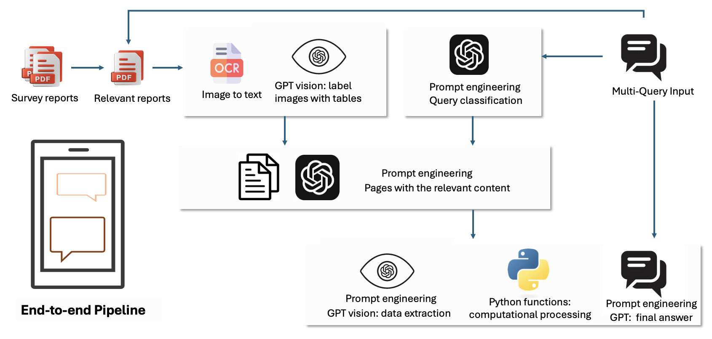

# HWP-LLM
LLM-Assisted Data Curation for Material Flow Analysis of Harvested Wood Products in British Columbia
The pipeline is stored in HWP_LLM.ipynb 

To use it, you need to add your GPT API key by modifying the following line in the script:os.environ["OPENAI_API_KEY"] = "" # Replace with your own GPT API key. Additionally, you must specify your own folder path in the sections marked with the comment "Replace with your folder path". In the Query Processing code block, multiple queries can be entered simultaneously. After running the model, the responses to each query will be displayed in the Answer the Query code block. For Type 4 queries, the extracted results are first displayed in the Answer the Query code block. The final structured table, with redundant headers removed, is then saved as a CSV file at the specified path.

# Model Overview

